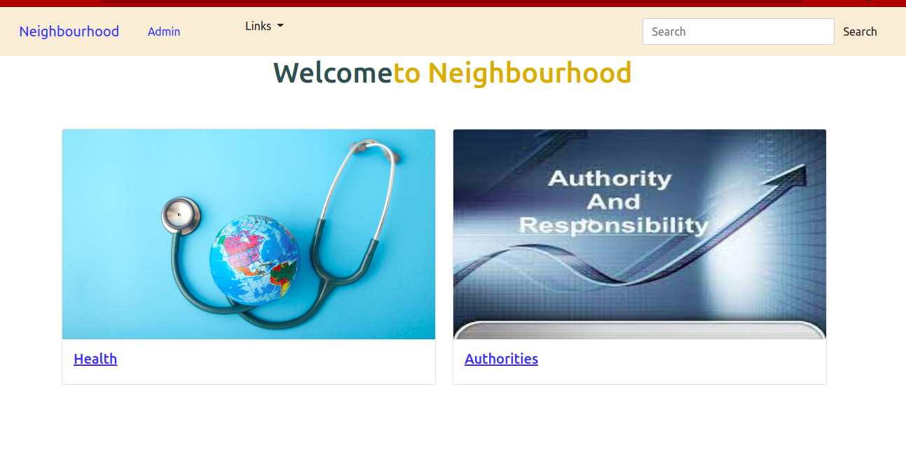
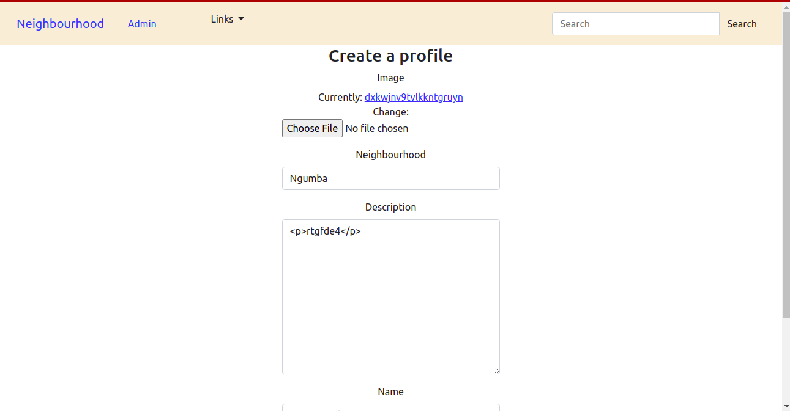
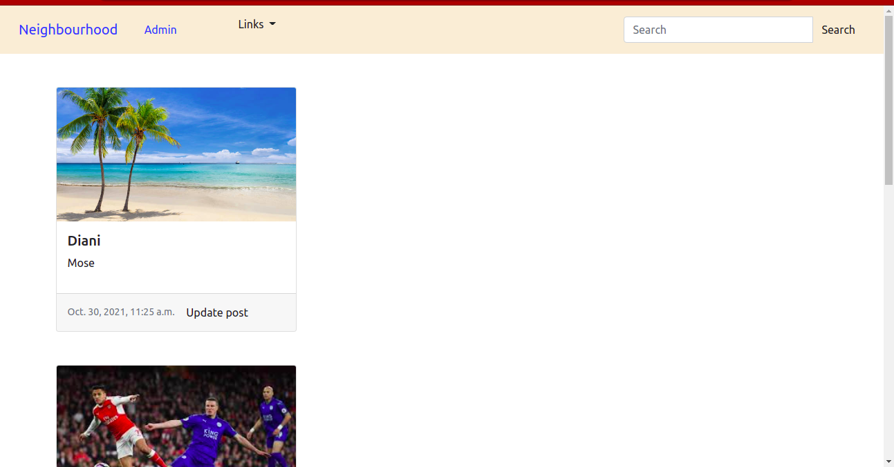
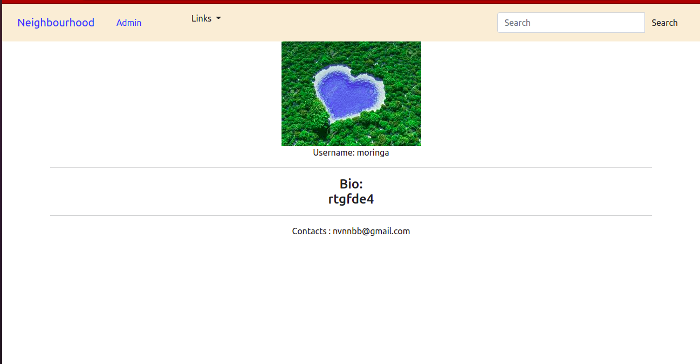

## myneighbourapp
Is an app that allows a user to sign in to start using it and set their profile including the general location of their neighbourhood and the name. The app allows a user to see businesses and access health and authority facilities.
## Author
Bernard Opiyo

## Setup Requirements
* Git
* Github
* Django 3.2.8
* PostgreSQL
* Web-browser of your choice
* pip
* Python 3.8.10
* Cloudinary (for image upload)

## Installation
Use the following command to install all the requirement applications. pip freeze -r requirements.txt

## setup
* Run git clone https://github.com/Bernard2030/myneighbourapp or download the zip file from github.

After extracting the files,

* Navigate to the project folder cd into it.

* Creating a virtual environment virtualenv virtual.

* Activating the virtual environment source virtual/bin/activate.

* Running the application python3 manage.py runserver

* Running tests python3 manage.py test.

* create database
    You will need to create a database a new postgress database by typing the following command to access postgress
        $ psql
    Then run below query to create a new database named instagramphotos
        
* create Database migrations
    make migrations on postgres using django
        python3.8 manage.py makemigrations 
    then run the below command.
        python3.8 manage.py migrate

## Technologies used
* Python3.8
* Django 
* rest_framework 
* HTML5 
* CSS 
* Bootstrap5
* PostgreSQL

user story

* Sign in with the application to start using.
* Set up a profile about me and a general location and my neighborhood name.
* Find a list of different businesses in my neighborhood.
* Find Contact Information for the health department and Police authorities near my neighborhood.
* Create Posts that will be visible to everyone in my neighborhood.
* Change My neighborhood when I decide to move out.
* Only view details of a single neighborhood.

## pictorial Discription

	
	
	
	
	
## Known Bugs
There are no known bugs at the moment if you find any reach out through brobernard.254@gmail.com

## Collaboration
To contribute on the application you can do so by reaching me on brobernard.254@gmail.com

## LICENSE
This project is under [MIT](LICENSE).